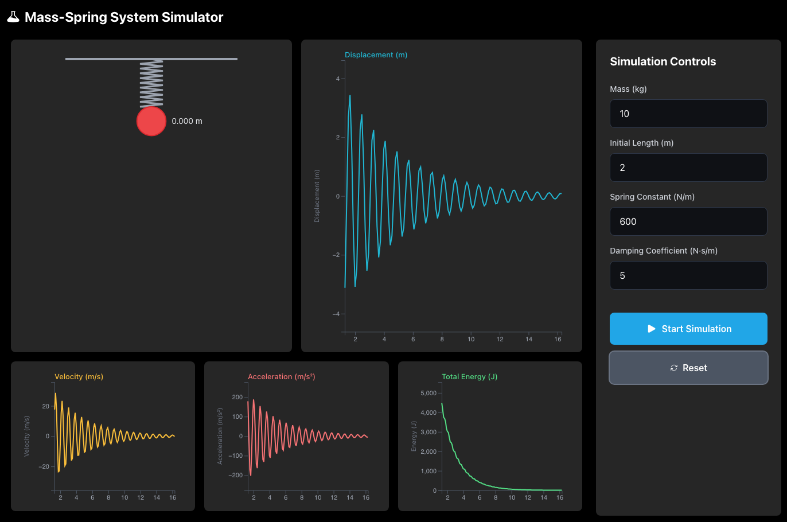

# Spring-Mass Oscillation Simulator

A browser-based physics simulation for exploring spring-mass oscillation systems. Built with React, TypeScript, D3.js, and Tailwind CSS and [Github Spec-Kit](https://github.com/github/spec-kit)

<p align="center">
	
</p>

## Features

- ⚙️ **Configurable Parameters**: Adjust mass, spring constant, and initial length
- 🎯 **Interactive Drag**: Pull the mass to set initial displacement
- 📊 **Real-Time Graphs**: Visualize displacement, velocity, acceleration, and energy
- ⏸️ **Simulation Controls**: Start, pause, resume, and reset
- 🎨 **Modern UI**: Clean, responsive design with Tailwind CSS
- ♿ **Accessible**: WCAG 2.1 AA compliant with keyboard navigation
- 🚀 **Performant**: 60 FPS animation, <80KB gzipped bundle

## Installation

```bash
# Install dependencies
npm install

# Start development server
npm run dev

# Open browser to http://localhost:5173
```

## Usage

1. **Configure Parameters** - Set mass, spring constant, and initial length
2. **Start Simulation** - Click "Start Simulation" button
3. **Drag Mass** - Pull the blue mass downward to create initial displacement
4. **Observe** - Watch real-time animation and 4 synchronized graphs
5. **Control** - Use Pause/Resume/Reset buttons as needed

## Technology Stack

- **React 18** + **TypeScript 5** (strict mode)
- **Vite 5** - Fast build tool
- **D3.js 7** - Graph rendering
- **Tailwind CSS 4** - Styling
- **RK4 Algorithm** - Physics integration

## Performance

- **Bundle Size**: 78.72 KB gzipped
- **Frame Rate**: 60 FPS target
- **Energy Conservation**: <1% error

## Scripts

```bash
npm run dev      # Development server
npm run build    # Production build
npm run preview  # Preview production build
```
